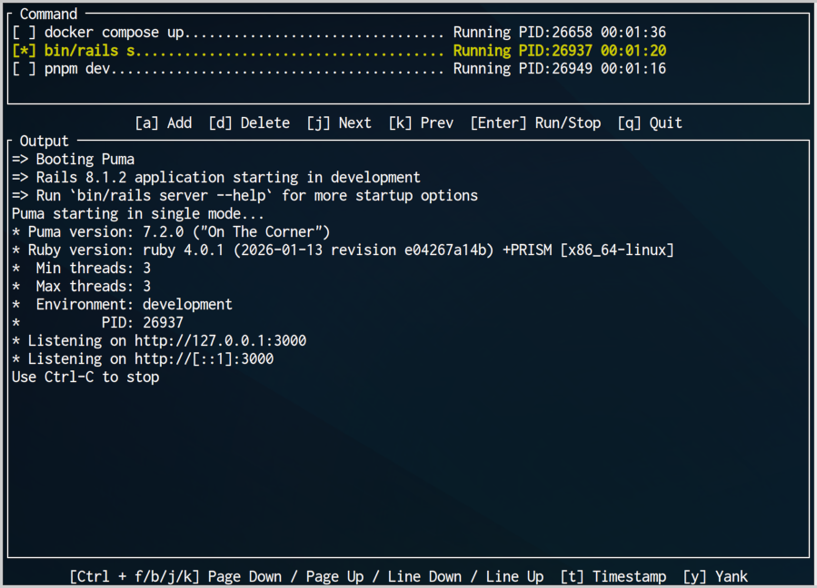

# Yagura

**yagura** is a lightweight TUI command runner for managing multiple development processes in a single, structured view.

Modern development often requires running several commands at once — frontend, backend, workers, etc...
yagura keeps them organized in one place.

> “yagura” (櫓) means a watchtower —
> a place to look over what is running.



## Requirements

- **OS**: Linux / macOS (Unix-like systems)
- **Rust**: 1.92.0 or later (uses Rust 2024 edition)

## Installation

### Build from Source

```bash
git clone https://github.com/ushiboy/yagura.git
cd yagura
cargo build --release
```

## Usage

### Basic Usage

```bash
# Run without config
yagura

# Run with config file
yagura -c .yagura.yaml

# Default config path is .yagura.yaml
yagura
```

### Configuration File

Place `.yagura.yaml` in your project root.

```yaml
workspace_root: "./"
commands:
  - command: "npm run dev"
    working_dir: "./frontend"
  - command: "cargo run --bin server"
    working_dir: "./backend"
  - command: "npm run worker"
    working_dir: "./worker"
```

Configuration fields:

- `workspace_root` (optional): Base directory for relative paths
- `commands`: List of commands
  - `command`: Command string to execute
  - `working_dir` (optional): Directory where the command runs

### Key Bindings

#### Normal Mode

- `j` / `↓` — Select next command
- `k` / `↑` — Select previous command
- `Enter` — Run/stop selected command
- `a` — Enter add command mode
- `d` — Enter delete command mode
- `Ctrl + f` — Scroll output area down one page
- `Ctrl + b` — Scroll output area up one page
- `Ctrl + j` — Scroll output area down one line
- `Ctrl + k` — Scroll output area up one line
- `t` — Toggle timestamp display
- `y` — Copy the contents displayed in the output area to the clipboard
- `h` — Toggle help display
- `q` — Quit

#### Add Command Mode

- `Enter` — Add command and return to normal mode
- `Esc` — Cancel and return to normal mode

#### Delete Command Mode

- `y` — Delete selected command
- `n` / `Esc` — Cancel and return to normal mode

## Development

### Build

```bash
# Debug build
cargo build

# Release build
cargo build --release
```

### Test

```bash
# Run all tests
cargo test

# Run specific test
cargo test test_name

# Run all tests in a module
cargo test model::output_buffer::tests::
```

### Format & Lint

```bash
# Format
cargo fmt

# Lint with auto-fix
cargo clippy --fix --bin yagura --allow-dirty
cargo clippy --fix --lib -p yagura --tests --allow-dirty
```

## License

MIT License
